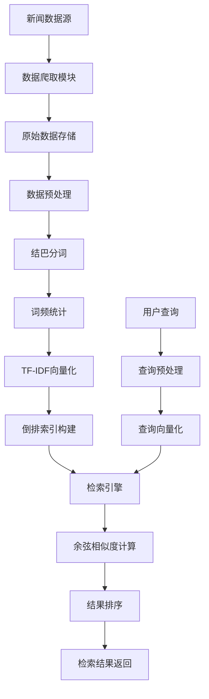

# 中文新闻稀疏检索系统设计文档

## 系统概述

本系统是一个基于结巴分词和TF-IDF算法的中文新闻稀疏检索原型系统，支持100-1000篇新闻文章的语义检索。

## 系统架构



## 1. 数据获取设计

### 1.1 数据来源
- **目标网站**: 新浪新闻、网易新闻、腾讯新闻等主流中文新闻网站
- **数据规模**: 100-1000篇新闻文章
- **数据类型**: 标题、正文、发布时间、分类等

### 1.2 爬取策略
```python
# 爬取模块设计
class NewsSpider:
    def __init__(self):
        self.headers = {...}  # 反爬虫头部信息
        self.delay = 1  # 请求间隔
    
    def crawl_news(self, url_list, max_articles=1000):
        # 实现爬取逻辑
        pass
    
    def parse_article(self, html):
        # 解析文章内容
        pass
```

### 1.3 数据存储格式
```json
{
    "id": "unique_id",
    "title": "新闻标题",
    "content": "新闻正文",
    "category": "新闻分类",
    "publish_time": "2024-01-01 12:00:00",
    "url": "原文链接",
    "word_count": 1200
}
```

## 2. 数据统计分析设计

### 2.1 原始数据统计
```python
class DataAnalyzer:
    def analyze_raw_data(self, news_data):
        statistics = {
            "total_articles": len(news_data),
            "avg_word_count": self.calculate_avg_length(news_data),
            "category_distribution": self.count_categories(news_data),
            "time_distribution": self.analyze_time_pattern(news_data),
            "content_length_distribution": self.analyze_length_distribution(news_data)
        }
        return statistics
```

### 2.2 统计指标
- **文章总数**: 爬取的新闻文章数量
- **平均字符数**: 每篇文章的平均字符长度
- **分类分布**: 各个新闻类别的文章数量分布
- **时间分布**: 新闻发布时间的分布情况
- **长度分布**: 文章长度的分布直方图

### 2.3 可视化展示
```python
import matplotlib.pyplot as plt
import seaborn as sns

def visualize_data_statistics(statistics):
    # 1. 分类分布饼图
    plt.figure(figsize=(10, 6))
    plt.pie(statistics['category_distribution'].values(), 
            labels=statistics['category_distribution'].keys())
    
    # 2. 文章长度分布直方图
    plt.figure(figsize=(10, 6))
    plt.hist(statistics['content_length_distribution'], bins=20)
    
    # 3. 时间分布折线图
    plt.figure(figsize=(12, 6))
    plt.plot(statistics['time_distribution'])
```

## 3. 结巴分词处理设计

### 3.1 分词模块架构
```python
import jieba
import jieba.posseg as pseg

class ChineseTokenizer:
    def __init__(self):
        # 加载自定义词典
        jieba.load_userdict("custom_dict.txt")
        
        # 停用词列表
        self.stopwords = self.load_stopwords()
    
    def tokenize(self, text):
        # 结巴分词
        words = jieba.cut(text, cut_all=False)
        
        # 过滤停用词和标点
        filtered_words = [word for word in words 
                         if word not in self.stopwords 
                         and len(word) > 1]
        
        return filtered_words
    
    def tokenize_with_pos(self, text):
        # 带词性标注的分词
        words = pseg.cut(text)
        return [(word, flag) for word, flag in words]
```

### 3.2 停用词处理
```python
# 停用词列表（部分示例）
STOPWORDS = [
    "的", "了", "在", "是", "我", "有", "和", "就",
    "不", "人", "都", "一", "一个", "上", "也", "很",
    "到", "说", "要", "去", "你", "会", "着", "没有",
    "看", "好", "自己", "这", "那", "什么", "时候"
]
```

## 4. 分词统计分析设计

### 4.1 分词统计指标
```python
class TokenStatistics:
    def analyze_tokens(self, tokenized_corpus):
        stats = {
            "total_tokens": self.count_total_tokens(tokenized_corpus),
            "unique_tokens": self.count_unique_tokens(tokenized_corpus),
            "avg_tokens_per_doc": self.calculate_avg_tokens(tokenized_corpus),
            "token_frequency": self.calculate_token_frequency(tokenized_corpus),
            "token_length_distribution": self.analyze_token_lengths(tokenized_corpus),
            "pos_tag_distribution": self.analyze_pos_tags(tokenized_corpus)
        }
        return stats
```

### 4.2 关键统计数据
- **总词汇量**: 语料库中所有词汇的总数
- **唯一词汇数**: 去重后的词汇数量
- **平均文档词数**: 每篇文档的平均词汇数
- **词频分布**: 高频词和低频词的分布
- **词长分布**: 不同长度词汇的分布
- **词性分布**: 名词、动词、形容词等词性的分布

### 4.3 分词质量评估
```python
def evaluate_segmentation_quality(original_text, segmented_text):
    metrics = {
        "segmentation_ratio": len(segmented_text) / len(original_text.replace(" ", "")),
        "avg_word_length": sum(len(word) for word in segmented_text) / len(segmented_text),
        "oov_rate": calculate_oov_rate(segmented_text),  # 未登录词率
        "segmentation_consistency": check_consistency(segmented_text)
    }
    return metrics
```

## 5. TF-IDF检索算法设计

### 5.1 TF-IDF计算
```python
import math
from collections import defaultdict, Counter

class TFIDFVectorizer:
    def __init__(self):
        self.vocabulary = {}
        self.idf_values = {}
        self.documents = []
    
    def fit_transform(self, documents):
        self.documents = documents
        self._build_vocabulary()
        self._calculate_idf()
        return self._transform_documents()
    
    def _calculate_tf(self, doc_tokens):
        """计算词频 (Term Frequency)"""
        tf_dict = Counter(doc_tokens)
        doc_length = len(doc_tokens)
        
        # 使用对数归一化的TF
        tf_normalized = {}
        for term, count in tf_dict.items():
            tf_normalized[term] = 1 + math.log(count) if count > 0 else 0
        
        return tf_normalized
    
    def _calculate_idf(self):
        """计算逆文档频率 (Inverse Document Frequency)"""
        N = len(self.documents)
        
        for term in self.vocabulary:
            # 计算包含该词的文档数
            df = sum(1 for doc in self.documents if term in doc)
            
            # IDF计算公式: log(N/df)
            self.idf_values[term] = math.log(N / df) if df > 0 else 0
    
    def _calculate_tfidf(self, tf_dict):
        """计算TF-IDF值"""
        tfidf_dict = {}
        for term, tf_value in tf_dict.items():
            idf_value = self.idf_values.get(term, 0)
            tfidf_dict[term] = tf_value * idf_value
        
        return tfidf_dict
```

### 5.2 向量化实现
```python
import numpy as np
from scipy.sparse import csr_matrix

class DocumentVectorizer:
    def __init__(self, tfidf_vectorizer):
        self.vectorizer = tfidf_vectorizer
        self.doc_vectors = None
    
    def vectorize_corpus(self, tokenized_documents):
        """将文档集合向量化"""
        vectors = []
        vocab_size = len(self.vectorizer.vocabulary)
        
        for doc_tokens in tokenized_documents:
            # 计算文档的TF-IDF向量
            tfidf_dict = self.vectorizer.transform_document(doc_tokens)
            
            # 创建稀疏向量
            vector = np.zeros(vocab_size)
            for term, tfidf_value in tfidf_dict.items():
                if term in self.vectorizer.vocabulary:
                    idx = self.vectorizer.vocabulary[term]
                    vector[idx] = tfidf_value
            
            vectors.append(vector)
        
        # 使用稀疏矩阵存储以节省内存
        self.doc_vectors = csr_matrix(np.array(vectors))
        return self.doc_vectors
```

## 6. 余弦相似度检索算法

### 6.1 相似度计算
```python
from sklearn.metrics.pairwise import cosine_similarity

class SimilaritySearcher:
    def __init__(self, doc_vectors, documents):
        self.doc_vectors = doc_vectors
        self.documents = documents
    
    def search(self, query_vector, top_k=10):
        """执行相似度检索"""
        # 计算查询向量与所有文档向量的余弦相似度
        similarities = cosine_similarity(query_vector, self.doc_vectors).flatten()
        
        # 获取相似度最高的文档索引
        top_indices = np.argsort(similarities)[::-1][:top_k]
        
        # 构造检索结果
        results = []
        for idx in top_indices:
            if similarities[idx] > 0:  # 只返回相似度大于0的结果
                results.append({
                    'document_id': idx,
                    'similarity_score': similarities[idx],
                    'document': self.documents[idx]
                })
        
        return results
    
    def cosine_similarity_manual(self, vec1, vec2):
        """手动实现余弦相似度计算"""
        dot_product = np.dot(vec1, vec2)
        norm_vec1 = np.linalg.norm(vec1)
        norm_vec2 = np.linalg.norm(vec2)
        
        if norm_vec1 == 0 or norm_vec2 == 0:
            return 0
        
        return dot_product / (norm_vec1 * norm_vec2)
```

### 6.2 查询处理
```python
class QueryProcessor:
    def __init__(self, tokenizer, vectorizer):
        self.tokenizer = tokenizer
        self.vectorizer = vectorizer
    
    def process_query(self, query_text):
        """处理用户查询"""
        # 1. 分词
        query_tokens = self.tokenizer.tokenize(query_text)
        
        # 2. 向量化
        query_vector = self.vectorizer.transform_query(query_tokens)
        
        return query_vector
    
    def expand_query(self, query_tokens):
        """查询扩展（可选功能）"""
        # 可以添加同义词扩展、词干还原等
        expanded_tokens = query_tokens.copy()
        
        # 示例：添加同义词
        synonyms = self.get_synonyms(query_tokens)
        expanded_tokens.extend(synonyms)
        
        return expanded_tokens
```

## 7. 系统集成设计

### 7.1 主检索引擎
```python
class ChineseNewsSearchEngine:
    def __init__(self):
        self.tokenizer = ChineseTokenizer()
        self.vectorizer = TFIDFVectorizer()
        self.searcher = None
        self.documents = []
        self.doc_vectors = None
    
    def build_index(self, news_data):
        """构建检索索引"""
        print("开始构建检索索引...")
        
        # 1. 文档预处理和分词
        tokenized_docs = []
        for article in news_data:
            tokens = self.tokenizer.tokenize(article['content'])
            tokenized_docs.append(tokens)
        
        # 2. TF-IDF向量化
        self.doc_vectors = self.vectorizer.fit_transform(tokenized_docs)
        
        # 3. 初始化检索器
        self.searcher = SimilaritySearcher(self.doc_vectors, news_data)
        
        print(f"索引构建完成，共处理 {len(news_data)} 篇文档")
    
    def search(self, query, top_k=10):
        """执行检索"""
        if not self.searcher:
            raise Exception("检索索引未构建，请先调用 build_index()")
        
        # 处理查询
        query_processor = QueryProcessor(self.tokenizer, self.vectorizer)
        query_vector = query_processor.process_query(query)
        
        # 执行检索
        results = self.searcher.search(query_vector, top_k)
        
        return results
```

### 7.2 用户接口
```python
class SearchInterface:
    def __init__(self, search_engine):
        self.engine = search_engine
    
    def interactive_search(self):
        """交互式检索界面"""
        print("=== 中文新闻检索系统 ===")
        print("输入查询内容，输入 'quit' 退出")
        
        while True:
            query = input("\n请输入查询: ").strip()
            
            if query.lower() == 'quit':
                break
            
            if not query:
                continue
            
            # 执行检索
            results = self.engine.search(query, top_k=5)
            
            # 显示结果
            self.display_results(query, results)
    
    def display_results(self, query, results):
        """显示检索结果"""
        print(f"\n查询: '{query}'")
        print(f"找到 {len(results)} 条相关结果:\n")
        
        for i, result in enumerate(results, 1):
            doc = result['document']
            score = result['similarity_score']
            
            print(f"{i}. 相似度: {score:.4f}")
            print(f"   标题: {doc['title']}")
            print(f"   摘要: {doc['content'][:100]}...")
            print(f"   分类: {doc.get('category', 'N/A')}")
            print("-" * 50)
```

## 8. 性能评估设计

### 8.1 评估指标
```python
class PerformanceEvaluator:
    def __init__(self, search_engine):
        self.engine = search_engine
    
    def evaluate_retrieval_performance(self, test_queries):
        """评估检索性能"""
        metrics = {
            "avg_response_time": [],
            "result_relevance": [],
            "coverage": 0,
            "precision_at_k": []
        }
        
        for query in test_queries:
            start_time = time.time()
            results = self.engine.search(query['text'])
            response_time = time.time() - start_time
            
            metrics["avg_response_time"].append(response_time)
            
            # 计算相关性（需要人工标注的真实标签）
            if 'relevant_docs' in query:
                precision = self.calculate_precision_at_k(
                    results, query['relevant_docs'], k=10
                )
                metrics["precision_at_k"].append(precision)
        
        return metrics
    
    def calculate_precision_at_k(self, results, relevant_docs, k=10):
        """计算P@K"""
        retrieved_docs = [r['document']['id'] for r in results[:k]]
        relevant_retrieved = len(set(retrieved_docs) & set(relevant_docs))
        return relevant_retrieved / min(k, len(retrieved_docs))
```

### 8.2 系统监控
```python
class SystemMonitor:
    def monitor_system_resources(self):
        """监控系统资源使用"""
        import psutil
        
        return {
            "memory_usage": psutil.virtual_memory().percent,
            "cpu_usage": psutil.cpu_percent(),
            "disk_usage": psutil.disk_usage('/').percent
        }
    
    def benchmark_search_speed(self, search_engine, queries, iterations=100):
        """基准测试检索速度"""
        import time
        
        times = []
        for _ in range(iterations):
            query = random.choice(queries)
            start = time.time()
            results = search_engine.search(query)
            end = time.time()
            times.append(end - start)
        
        return {
            "avg_time": np.mean(times),
            "min_time": np.min(times),
            "max_time": np.max(times),
            "std_time": np.std(times)
        }
```

## 9. 项目结构

```
chinese_news_search/
├── README.md
├── requirements.txt
├── config/
│   ├── settings.py
│   └── stopwords.txt
├── data/
│   ├── raw/          # 原始爬取数据
│   ├── processed/    # 处理后的数据
│   └── analysis/     # 分析结果
├── src/
│   ├── __init__.py
│   ├── crawler/
│   │   ├── __init__.py
│   │   └── news_spider.py
│   ├── preprocessing/
│   │   ├── __init__.py
│   │   ├── tokenizer.py
│   │   └── analyzer.py
│   ├── retrieval/
│   │   ├── __init__.py
│   │   ├── tfidf.py
│   │   ├── similarity.py
│   │   └── search_engine.py
│   └── evaluation/
│       ├── __init__.py
│       └── metrics.py
├── tests/
│   ├── test_crawler.py
│   ├── test_tokenizer.py
│   └── test_search.py
├── notebooks/
│   ├── data_analysis.ipynb
│   ├── segmentation_analysis.ipynb
│   └── retrieval_evaluation.ipynb
└── main.py
```

## 10. 技术栈

### 10.1 核心依赖
```txt
jieba==0.42.1                # 中文分词
numpy==1.24.3               # 数值计算
scipy==1.10.1               # 科学计算
scikit-learn==1.3.0         # 机器学习工具
requests==2.31.0            # HTTP请求
beautifulsoup4==4.12.2      # HTML解析
pandas==2.0.3               # 数据处理
matplotlib==3.7.1           # 数据可视化
seaborn==0.12.2             # 统计可视化
lxml==4.9.3                 # XML/HTML解析
```

### 10.2 开发工具
```txt
jupyter==1.0.0              # 交互式开发
pytest==7.4.0               # 单元测试
black==23.7.0               # 代码格式化
flake8==6.0.0               # 代码检查
```

## 11. 实施计划

1. **环境搭建** (1天)
   - 安装Python环境和依赖包
   - 配置开发环境

2. **数据获取** (2-3天)
   - 开发新闻爬虫
   - 爬取100-1000篇新闻
   - 数据清洗和存储

3. **数据分析** (1天)
   - 原始数据统计分析
   - 生成数据报告和可视化

4. **分词模块** (1-2天)
   - 集成结巴分词
   - 分词效果分析
   - 停用词处理

5. **检索算法** (2-3天)
   - TF-IDF实现
   - 余弦相似度计算
   - 检索引擎集成

6. **系统测试** (1天)
   - 功能测试
   - 性能评估
   - 用户界面开发

7. **文档整理** (1天)
   - 编写技术文档
   - 准备演示材料

总计：约7-10个工作日

这个设计文档提供了完整的系统架构和实施方案，涵盖了您要求的所有组件：数据获取、统计分析、分词处理、检索算法等。整个系统采用模块化设计，便于开发和维护。